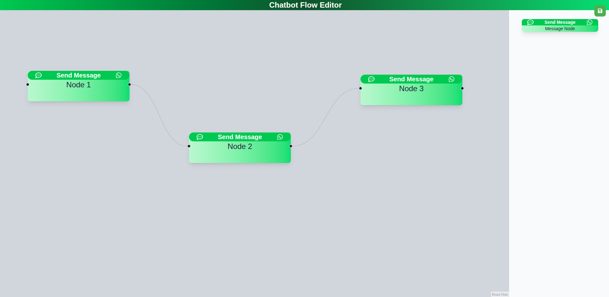

# Chatbot Flow Editor

A dynamic and interactive flow editor built with React and `@xyflow/react`, designed for creating and managing chatbot conversation flows.

## 🛠️ Features

- **Customizable Nodes**: Drag-and-drop nodes with customizable content and styles.
- **Interactive Edges**: Connect nodes with edges, supporting multiple handles and validation.
- **Settings Panel**: Edit node content through a user-friendly settings panel.
- **Validation**: Warns when multiple empty target handles are present.
- **Responsive Design**: Optimized for desktop and mobile views.:contentReference[oaicite:10]{index=10}
## 📸 Screenshots

### FlowEditor

### Setting Pannel

## Live Demo

